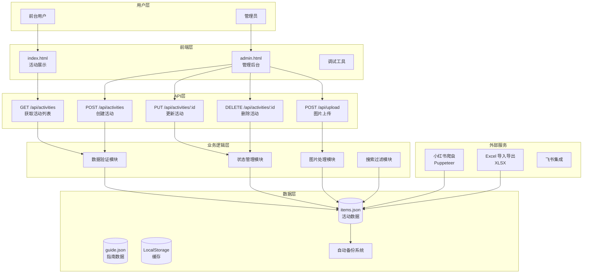
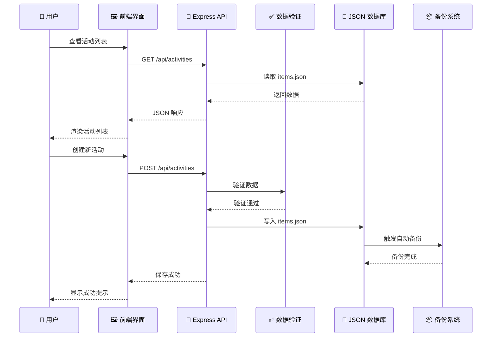
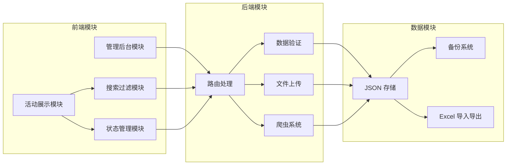
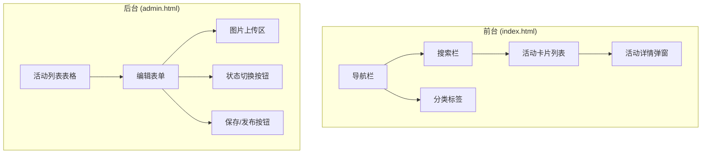
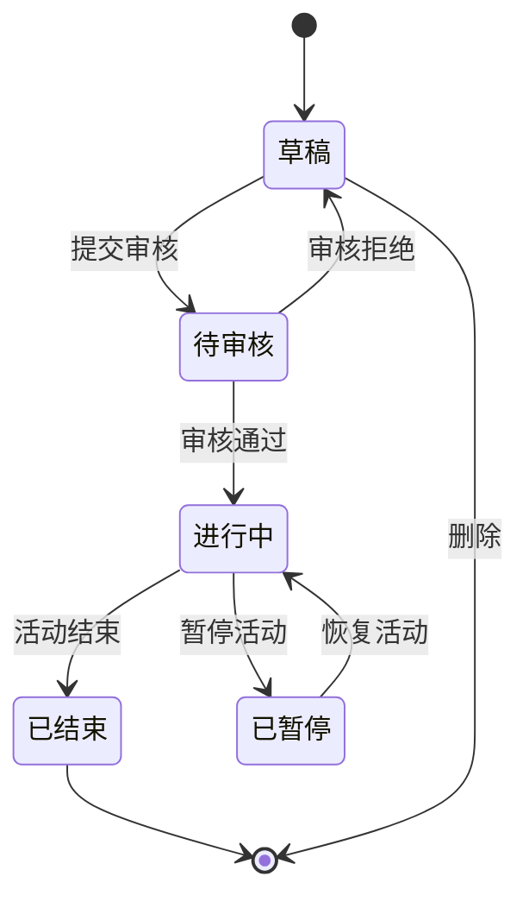

# Chiengmai 项目架构图

> **生成时间**: 2026-02-27
> **项目版本**: v2.0.0

---

## 🏗️ 系统整体架构

---

## 🔄 数据流向图

---

## 🎯 模块依赖关系

---

## 🎨 UI 组件结构

---

## 🔐 状态机流程

---

**使用说明**：

1. **在 GitHub/GitLab 中查看**：直接复制代码到 Markdown 文件，平台会自动渲染
2. **在 VS Code 中查看**：安装 "Markdown Preview Mermaid Support" 插件
3. **导出为图片**：使用 Mermaid Live Editor (https://mermaid.live) 导出 PNG/SVG

---

**文档版本**: v1.0.0
**生成工具**: Claude Code
**最后更新**: 2026-02-27
